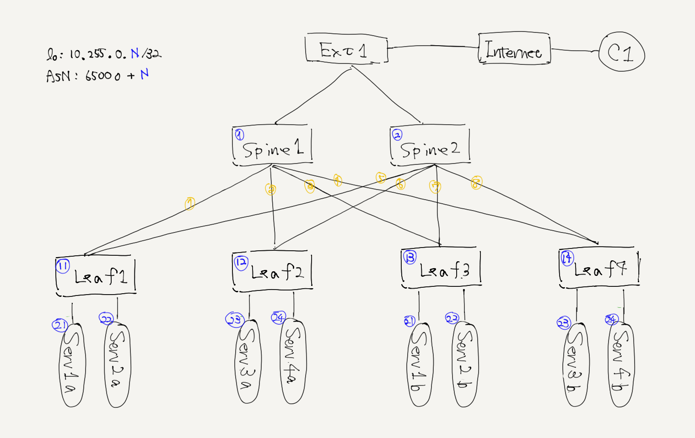
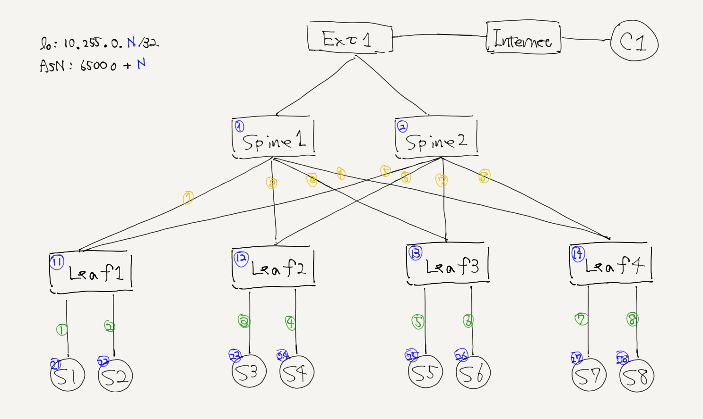
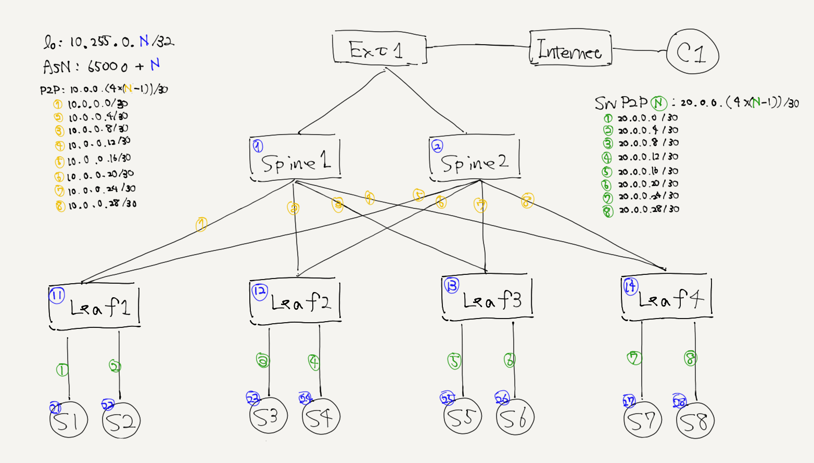

# CLOS Topology

Practice of designing DCN. Following are principle of Design.
- using modernaized technology (such as BGP-unnumbered.)

Version
- 0.0.0: basic CLOS-network ([yaml](./spec.v0.0.0.yaml))
- 0.0.1: using BGP-unnumbered ([yaml](./spec.v0.0.1.yaml))
- 0.0.2: using ECMP anycast (**currentry version**) ([yaml](./spec.v0.0.2.yaml))
- 0.0.3: add VM and ToR nodes
- 0.0.4: support multi-tenancy
- 0.0.5: support SRv6 network slicing for multi-tenant (like-a LINE-SRv6-DCN)

**version v0.0.2**

**version v0.0.1**

**version v0.0.0**

references
- LINE-SRv6-DCN ENOG55 http://enog.jp/wp-content/uploads/2018/12/05_20190222_ENOG55_LINE.pdf
- Large Scale DC Network Design https://www.slideshare.net/MasayukiKobayashi/dc-66865243
- Good TiNET examples by MIYA-kun https://github.com/mi2428/netben
- LINE DCN Overview by Kobayashi-san 2018.10 https://www.slideshare.net/linecorp/ss-116867631
- About designing the LINE-NW from scrach by Kobayashi-san 2019.01 https://www.janog.gr.jp/meeting/janog43/application/files/7915/4823/1858/janog43-line-kobayashi.pdf

