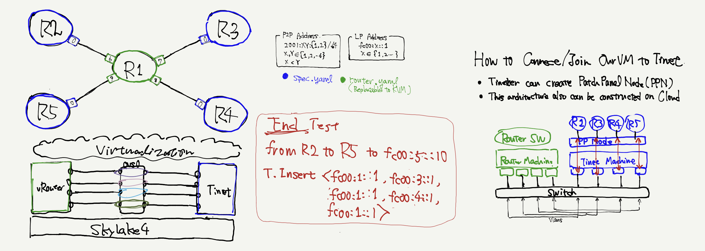

# Test Environment for SRv6-dev
- Hiroki Shirokura <slankdev@coe.ad.jp>
- 2019.01.02



## Evaluation on your laptop Rapidly

```
# ovs-vsctl add-br ovs0 && ip link set ovs0 up
# tn -f kmee.yaml upconf | sh
# tn -f spec.yaml upconf | sh
```

Please follow the `For SRv6 Debugger`.

## Evaluation on dev-env

```
hypervisor# virsh start router
hypervisor# virsh start tinet
hypervisor# ovs-vsctl set port port-0-6-0 tag=60
hypervisor# ovs-vsctl set port port-0-7-0 tag=70
hypervisor# ovs-vsctl set port port-0-8-0 tag=80
hypervisor# ovs-vsctl set port port-0-9-0 tag=90
hypervisor# ovs-vsctl set port tinet6 tag=60
hypervisor# ovs-vsctl set port tinet7 tag=70
hypervisor# ovs-vsctl set port tinet8 tag=80
hypervisor# ovs-vsctl set port tinet9 tag=90
tinet# ovs-vsctl add-br ovs0 && ip link set ovs0 up
tinet# tn -f spec.yaml upconf | sh
router# ovs-vsctl add-br ovs0 && ip link set ovs0 up
tinet# tn -f kmee.yaml upconf | sh
```
Please follow the `For SRv6 Debugger`.

## For SRv6 Debugger

TestOperation
```
$ docker exec -it R2 \
    ip -6 route replace fc00:5::1 encap seg6 mode encap \
    segs fc00:1::1,fc00:3::1,fc00:1::1,fc00:4::1,fc00:1::1 dev net0
$ docker exec -it R2 ping -I fc00:2::1 fc00:5::1
...
```

For Debugger, please execute `$ tmux source-file debug.tmux`.
Then, you can check each interface in/out packets like a following.

```
 +---------------------------+----------------------------+
 | [0] srdump on R2' net0-in | [1] srdump on R2' net0-out |
 +---------------------------+----------------------------+
 | [2] srdump on R3' net0-in | [3] srdump on R3' net0-out |
 +---------------------------+----------------------------+
 | [4] srdump on R4' net0-in | [5] srdump on R4' net0-out |
 +---------------------------+----------------------------+
 | [6] srdump on R5' net0-in | [7] srdump on R5' net0-out |
 +---------------------------+----------------------------+
```

